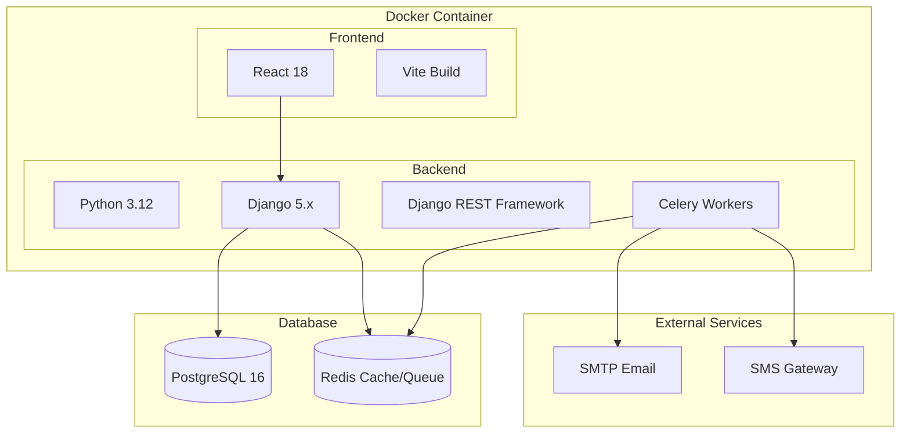

# ACML Community Platform - Technical Architecture

> **Stack:** Python/Django + React | **Database:** PostgreSQL | **Deployment:** Docker  
> **Philosophy:** Simple monolith, easy to deploy and maintain

---

## Architecture Overview



---

## Technology Stack

| Layer | Technology | Purpose |
|-------|------------|---------|
| **Language** | Python 3.12 | Backend logic |
| **Framework** | Django 5.x | Web framework, ORM, Admin |
| **API** | Django REST Framework | REST API for React |
| **Frontend** | React 18 + Vite | SPA with TypeScript |
| **Database** | PostgreSQL 16 | Primary data store |
| **Cache/Queue** | Redis | Celery broker, caching |
| **Task Queue** | Celery | Background jobs (email, SMS) |
| **Email** | SMTP (SendGrid/Mailgun) | Transactional emails |
| **SMS** | Twilio / Vonage | SMS notifications |
| **Containerization** | Docker + Compose | Development & deployment |

---

## Project Structure

```
acml-platform/
├── docker-compose.yml
├── docker-compose.prod.yml
├── .env.example
│
├── backend/
│   ├── Dockerfile
│   ├── requirements.txt
│   ├── manage.py
│   ├── config/
│   │   ├── settings/
│   │   │   ├── base.py
│   │   │   ├── development.py
│   │   │   └── production.py
│   │   ├── urls.py
│   │   ├── celery.py
│   │   └── wsgi.py
│   │
│   ├── apps/
│   │   ├── members/           # P1 - Member management
│   │   │   ├── models.py
│   │   │   ├── serializers.py
│   │   │   ├── views.py
│   │   │   ├── urls.py
│   │   │   └── admin.py
│   │   │
│   │   ├── communications/    # P1 - Announcements, calendar
│   │   │   ├── models.py
│   │   │   ├── serializers.py
│   │   │   ├── views.py
│   │   │   └── tasks.py       # Celery tasks
│   │   │
│   │   ├── events/            # P2 - Events, registrations
│   │   │   ├── models.py
│   │   │   ├── serializers.py
│   │   │   └── views.py
│   │   │
│   │   ├── education/         # P3 - Courses, students
│   │   │   ├── models.py
│   │   │   ├── serializers.py
│   │   │   └── views.py
│   │   │
│   │   ├── finance/           # P4 - Donations, receipts
│   │   │   ├── models.py
│   │   │   ├── serializers.py
│   │   │   └── views.py
│   │   │
│   │   └── resources/         # P5 - Room booking
│   │       ├── models.py
│   │       ├── serializers.py
│   │       └── views.py
│   │
│   └── core/                  # Shared utilities
│       ├── models.py          # Base models
│       ├── permissions.py     # RBAC
│       └── utils.py
│
├── frontend/
│   ├── Dockerfile
│   ├── package.json
│   ├── vite.config.ts
│   ├── src/
│   │   ├── main.tsx
│   │   ├── App.tsx
│   │   ├── api/               # API client
│   │   ├── components/        # Reusable components
│   │   ├── pages/             # Page components
│   │   ├── hooks/             # Custom hooks
│   │   ├── stores/            # State management
│   │   └── types/             # TypeScript types
│   └── public/
│
└── nginx/
    ├── Dockerfile
    └── nginx.conf
```

---

## Database ERD

```mermaid
erDiagram
    members ||--o{ member_families : has
    members ||--o{ member_skills : has
    members ||--o{ member_contributions : makes
    members ||--o{ donations : donates
    members ||--o{ notifications : receives
    members ||--o{ event_registrations : registers
    members }|--o{ students : parent_of
    members ||--o{ courses : teaches
    members ||--o{ member_cards : has
    
    events ||--o{ event_registrations : has
    events ||--o{ event_photos : contains
    events ||--o{ event_feedback : receives
    
    courses ||--o{ students : enrolls
    courses ||--o{ course_levels : has
    courses ||--o{ attendance : tracks
    
    campaigns ||--o{ donations : receives
    donations ||--o| tax_receipts : generates
    
    resources ||--o{ reservations : booked_for
    members ||--o{ reservations : makes

    members {
        uuid id PK
        string email UK
        string first_name
        string last_name
        string phone
        enum gender
        enum status
        enum membership_type
        timestamp consent_at
        string consent_version
        timestamp created_at
        timestamp updated_at
    }
    
    member_families {
        uuid id PK
        uuid member_id FK
        uuid related_member_id FK
        enum relationship
        string first_name
        string last_name
    }

    member_skills {
        uuid id PK
        uuid member_id FK
        string skill_name
        string proficiency
    }

    member_contributions {
        uuid id PK
        uuid member_id FK
        enum type
        decimal amount
        decimal hours
        string description
        date contributed_at
    }

    member_cards {
        uuid id PK
        uuid member_id FK
        string card_number UK
        int year
        date expires_at
    }

    events {
        uuid id PK
        string title
        text description
        timestamp start_date
        timestamp end_date
        string location
        int max_capacity
        int current_registrations
        enum status
        boolean image_consent_required
        string barcode_prefix
    }

    event_registrations {
        uuid id PK
        uuid event_id FK
        uuid member_id FK
        enum status
        string barcode UK
        boolean image_consent
        timestamp registered_at
        timestamp checked_in_at
    }

    event_photos {
        uuid id PK
        uuid event_id FK
        string file_path
        string caption
        uuid uploaded_by FK
    }

    event_feedback {
        uuid id PK
        uuid event_id FK
        uuid member_id FK
        int rating
        text comment
    }

    donations {
        uuid id PK
        uuid member_id FK
        uuid campaign_id FK
        uuid receipt_id FK
        decimal amount
        enum type
        enum payment_method
        string payment_id
        enum status
        boolean receipt_issued
        timestamp donated_at
    }

    campaigns {
        uuid id PK
        string name
        text description
        decimal goal_amount
        decimal current_amount
        date start_date
        date end_date
        boolean is_active
    }

    tax_receipts {
        uuid id PK
        uuid member_id FK
        string receipt_number UK
        int year
        decimal total_amount
        string organization_number
        string pdf_path
    }

    courses {
        uuid id PK
        uuid teacher_id FK
        string name
        text description
        string schedule
        string current_session
        enum status
    }

    course_levels {
        uuid id PK
        uuid course_id FK
        string name
        int order_num
        text description
    }

    students {
        uuid id PK
        uuid parent_member_id FK
        uuid course_id FK
        uuid level_id FK
        string first_name
        string last_name
        date birth_date
        enum payment_status
        timestamp enrolled_at
    }

    attendance {
        uuid id PK
        uuid student_id FK
        uuid course_id FK
        date date
        enum status
        text notes
    }

    announcements {
        uuid id PK
        string title
        text content
        enum category
        enum status
        timestamp published_at
        timestamp expires_at
        uuid created_by FK
    }

    calendar_events {
        uuid id PK
        string title
        text description
        timestamp start_time
        timestamp end_time
        string location
        enum category
    }

    newsletters {
        uuid id PK
        string subject
        text content
        string template_id
        timestamp sent_at
        int recipient_count
    }

    notifications {
        uuid id PK
        uuid member_id FK
        enum channel
        string subject
        text content
        enum status
        timestamp sent_at
    }

    resources {
        uuid id PK
        string name
        enum type
        text description
        int capacity
        boolean is_available
    }

    reservations {
        uuid id PK
        uuid resource_id FK
        uuid member_id FK
        timestamp start_time
        timestamp end_time
        enum status
        text notes
    }
```



---

## Django Models (Core Examples)

### Members App

```python
# backend/apps/members/models.py
import uuid
from django.db import models
from django.contrib.auth.models import AbstractUser


class Member(AbstractUser):
    """Extended user model for community members."""
    
    class Gender(models.TextChoices):
        MALE = 'M', 'Homme'
        FEMALE = 'F', 'Femme'
    
    class Status(models.TextChoices):
        ACTIVE = 'ACTIVE', 'Actif'
        INACTIVE = 'INACTIVE', 'Inactif'
        PENDING = 'PENDING', 'En attente'
    
    class MembershipType(models.TextChoices):
        MONTHLY = 'MONTHLY', 'Mensuel'
        ANNUAL = 'ANNUAL', 'Annuel'
    
    id = models.UUIDField(primary_key=True, default=uuid.uuid4, editable=False)
    phone = models.CharField(max_length=20, blank=True)
    gender = models.CharField(max_length=1, choices=Gender.choices)
    status = models.CharField(max_length=10, choices=Status.choices, default=Status.PENDING)
    membership_type = models.CharField(max_length=10, choices=MembershipType.choices, null=True)
    
    # Law 25 Compliance
    consent_timestamp = models.DateTimeField(null=True)
    consent_version = models.CharField(max_length=20, null=True)
    data_retention_date = models.DateField(null=True)
    
    created_at = models.DateTimeField(auto_now_add=True)
    updated_at = models.DateTimeField(auto_now=True)
    
    class Meta:
        db_table = 'members'
        indexes = [
            models.Index(fields=['status', 'created_at']),
            models.Index(fields=['email']),
        ]


class MemberFamily(models.Model):
    """Family relationships for members."""
    
    class Relationship(models.TextChoices):
        SPOUSE = 'SPOUSE', 'Conjoint(e)'
        CHILD = 'CHILD', 'Enfant'
        PARENT = 'PARENT', 'Parent'
    
    id = models.UUIDField(primary_key=True, default=uuid.uuid4, editable=False)
    member = models.ForeignKey(Member, on_delete=models.CASCADE, related_name='families')
    related_member = models.ForeignKey(Member, on_delete=models.SET_NULL, null=True, blank=True)
    relationship = models.CharField(max_length=10, choices=Relationship.choices)
    first_name = models.CharField(max_length=100, blank=True)
    last_name = models.CharField(max_length=100, blank=True)
    created_at = models.DateTimeField(auto_now_add=True)
    
    class Meta:
        db_table = 'member_families'


class MemberSkill(models.Model):
    """Skills that members can offer."""
    
    id = models.UUIDField(primary_key=True, default=uuid.uuid4, editable=False)
    member = models.ForeignKey(Member, on_delete=models.CASCADE, related_name='skills')
    skill_name = models.CharField(max_length=100)
    proficiency = models.CharField(max_length=50, blank=True)
    
    class Meta:
        db_table = 'member_skills'
        unique_together = ['member', 'skill_name']


class MemberContribution(models.Model):
    """Track member contributions (volunteer hours, etc)."""
    
    class ContributionType(models.TextChoices):
        COTISATION = 'COTISATION', 'Cotisation'
        DON = 'DON', 'Don'
        BENEVOLE = 'BENEVOLE', 'Bénévolat'
    
    id = models.UUIDField(primary_key=True, default=uuid.uuid4, editable=False)
    member = models.ForeignKey(Member, on_delete=models.CASCADE, related_name='contributions')
    type = models.CharField(max_length=15, choices=ContributionType.choices)
    amount = models.DecimalField(max_digits=10, decimal_places=2, null=True)
    hours = models.DecimalField(max_digits=5, decimal_places=2, null=True)
    description = models.TextField(blank=True)
    contributed_at = models.DateField()
    created_at = models.DateTimeField(auto_now_add=True)
    
    class Meta:
        db_table = 'member_contributions'
        indexes = [
            models.Index(fields=['member', 'contributed_at']),
        ]


class MemberCard(models.Model):
    """Digital member cards."""
    
    id = models.UUIDField(primary_key=True, default=uuid.uuid4, editable=False)
    member = models.ForeignKey(Member, on_delete=models.CASCADE, related_name='cards')
    card_number = models.CharField(max_length=50, unique=True)
    year = models.PositiveIntegerField()
    issued_at = models.DateTimeField(auto_now_add=True)
    expires_at = models.DateField(null=True)
    
    class Meta:
        db_table = 'member_cards'
        unique_together = ['member', 'year']
```

### Events App

```python
# backend/apps/events/models.py
import uuid
from django.db import models
from apps.members.models import Member


class Event(models.Model):
    """Community events."""
    
    class Status(models.TextChoices):
        DRAFT = 'DRAFT', 'Brouillon'
        OPEN = 'OPEN', 'Ouvert'
        CLOSED = 'CLOSED', 'Fermé'
        COMPLETED = 'COMPLETED', 'Terminé'
        CANCELLED = 'CANCELLED', 'Annulé'
    
    id = models.UUIDField(primary_key=True, default=uuid.uuid4, editable=False)
    title = models.CharField(max_length=255)
    description = models.TextField(blank=True)
    start_date = models.DateTimeField()
    end_date = models.DateTimeField()
    location = models.CharField(max_length=255, blank=True)
    max_capacity = models.PositiveIntegerField(null=True)
    current_registrations = models.PositiveIntegerField(default=0)
    status = models.CharField(max_length=15, choices=Status.choices, default=Status.DRAFT)
    image_consent_required = models.BooleanField(default=False)
    barcode_prefix = models.CharField(max_length=20, blank=True)
    created_by = models.ForeignKey(Member, on_delete=models.SET_NULL, null=True)
    created_at = models.DateTimeField(auto_now_add=True)
    updated_at = models.DateTimeField(auto_now=True)
    
    class Meta:
        db_table = 'events'
        indexes = [
            models.Index(fields=['status', 'start_date']),
        ]


class EventRegistration(models.Model):
    """Event registrations."""
    
    class Status(models.TextChoices):
        REGISTERED = 'REGISTERED', 'Inscrit'
        CHECKED_IN = 'CHECKED_IN', 'Présent'
        CANCELLED = 'CANCELLED', 'Annulé'
    
    id = models.UUIDField(primary_key=True, default=uuid.uuid4, editable=False)
    event = models.ForeignKey(Event, on_delete=models.CASCADE, related_name='registrations')
    member = models.ForeignKey(Member, on_delete=models.CASCADE, related_name='event_registrations')
    status = models.CharField(max_length=15, choices=Status.choices, default=Status.REGISTERED)
    barcode = models.CharField(max_length=50, unique=True)
    image_consent = models.BooleanField(default=False)
    registered_at = models.DateTimeField(auto_now_add=True)
    checked_in_at = models.DateTimeField(null=True)
    
    class Meta:
        db_table = 'event_registrations'
        unique_together = ['event', 'member']
        indexes = [
            models.Index(fields=['member', 'registered_at']),
        ]
```

### Finance App

```python
# backend/apps/finance/models.py
import uuid
from django.db import models
from apps.members.models import Member


class Campaign(models.Model):
    """Fundraising campaigns."""
    
    id = models.UUIDField(primary_key=True, default=uuid.uuid4, editable=False)
    name = models.CharField(max_length=255)
    description = models.TextField(blank=True)
    goal_amount = models.DecimalField(max_digits=10, decimal_places=2, null=True)
    current_amount = models.DecimalField(max_digits=10, decimal_places=2, default=0)
    start_date = models.DateField(null=True)
    end_date = models.DateField(null=True)
    is_active = models.BooleanField(default=True)
    created_at = models.DateTimeField(auto_now_add=True)
    
    class Meta:
        db_table = 'campaigns'


class TaxReceipt(models.Model):
    """Tax receipts for donations."""
    
    id = models.UUIDField(primary_key=True, default=uuid.uuid4, editable=False)
    member = models.ForeignKey(Member, on_delete=models.CASCADE, related_name='tax_receipts')
    receipt_number = models.CharField(max_length=50, unique=True)
    year = models.PositiveIntegerField()
    total_amount = models.DecimalField(max_digits=10, decimal_places=2)
    organization_number = models.CharField(max_length=50)
    pdf_path = models.CharField(max_length=500)
    issued_at = models.DateTimeField(auto_now_add=True)
    
    class Meta:
        db_table = 'tax_receipts'


class Donation(models.Model):
    """Donations and contributions."""
    
    class DonationType(models.TextChoices):
        COTISATION = 'COTISATION', 'Cotisation'
        DON_PONCTUEL = 'DON_PONCTUEL', 'Don ponctuel'
        DON_RECURRENT = 'DON_RECURRENT', 'Don récurrent'
    
    class PaymentMethod(models.TextChoices):
        STRIPE = 'STRIPE', 'Carte de crédit'
        INTERAC = 'INTERAC', 'Interac'
        PAYPAL = 'PAYPAL', 'PayPal'
        CASH = 'CASH', 'Espèces'
    
    class Status(models.TextChoices):
        PENDING = 'PENDING', 'En attente'
        COMPLETED = 'COMPLETED', 'Complété'
        FAILED = 'FAILED', 'Échoué'
        REFUNDED = 'REFUNDED', 'Remboursé'
    
    id = models.UUIDField(primary_key=True, default=uuid.uuid4, editable=False)
    member = models.ForeignKey(Member, on_delete=models.SET_NULL, null=True, related_name='donations')
    campaign = models.ForeignKey(Campaign, on_delete=models.SET_NULL, null=True, related_name='donations')
    receipt = models.ForeignKey(TaxReceipt, on_delete=models.SET_NULL, null=True)
    amount = models.DecimalField(max_digits=10, decimal_places=2)
    currency = models.CharField(max_length=3, default='CAD')
    type = models.CharField(max_length=20, choices=DonationType.choices)
    payment_method = models.CharField(max_length=15, choices=PaymentMethod.choices)
    payment_id = models.CharField(max_length=255, blank=True)
    status = models.CharField(max_length=15, choices=Status.choices, default=Status.PENDING)
    receipt_issued = models.BooleanField(default=False)
    donated_at = models.DateTimeField(auto_now_add=True)
    
    class Meta:
        db_table = 'donations'
        indexes = [
            models.Index(fields=['member', 'donated_at']),
            models.Index(fields=['status', 'donated_at']),
        ]
```

---

## API Endpoints (Django REST Framework)

```python
# backend/apps/members/urls.py
from django.urls import path, include
from rest_framework.routers import DefaultRouter
from . import views

router = DefaultRouter()
router.register(r'members', views.MemberViewSet)
router.register(r'families', views.MemberFamilyViewSet)
router.register(r'skills', views.MemberSkillViewSet)
router.register(r'contributions', views.MemberContributionViewSet)
router.register(r'cards', views.MemberCardViewSet)

urlpatterns = [
    path('', include(router.urls)),
]
```

### API Structure

| Endpoint | Methods | Description |
|----------|---------|-------------|
| `/api/members/` | GET, POST | List/create members |
| `/api/members/{id}/` | GET, PUT, DELETE | Member detail |
| `/api/members/{id}/families/` | GET, POST | Member's family |
| `/api/members/{id}/donations/` | GET | Member's donations |
| `/api/events/` | GET, POST | List/create events |
| `/api/events/{id}/registrations/` | GET, POST | Event registrations |
| `/api/courses/` | GET, POST | List/create courses |
| `/api/courses/{id}/students/` | GET, POST | Course students |
| `/api/donations/` | GET, POST | List/create donations |
| `/api/campaigns/` | GET, POST | Fundraising campaigns |

---

## Celery Tasks (Background Jobs)

```python
# backend/apps/communications/tasks.py
from celery import shared_task
from django.core.mail import send_mail
from django.conf import settings


@shared_task
def send_notification_email(member_id: str, subject: str, message: str):
    """Send email notification to a member."""
    from apps.members.models import Member
    
    member = Member.objects.get(id=member_id)
    send_mail(
        subject=subject,
        message=message,
        from_email=settings.DEFAULT_FROM_EMAIL,
        recipient_list=[member.email],
    )


@shared_task
def send_bulk_newsletter(newsletter_id: str):
    """Send newsletter to all active members."""
    from apps.members.models import Member
    from .models import Newsletter
    
    newsletter = Newsletter.objects.get(id=newsletter_id)
    members = Member.objects.filter(status='ACTIVE')
    
    for member in members:
        send_mail(
            subject=newsletter.subject,
            message=newsletter.content,
            from_email=settings.DEFAULT_FROM_EMAIL,
            recipient_list=[member.email],
        )
    
    newsletter.recipient_count = members.count()
    newsletter.sent_at = timezone.now()
    newsletter.save()


@shared_task
def send_sms_notification(phone: str, message: str):
    """Send SMS via Twilio."""
    from twilio.rest import Client
    
    client = Client(settings.TWILIO_SID, settings.TWILIO_TOKEN)
    client.messages.create(
        body=message,
        from_=settings.TWILIO_PHONE,
        to=phone
    )
```

---

## Docker Configuration

### docker-compose.yml

```yaml
version: '3.9'

services:
  backend:
    build: ./backend
    command: python manage.py runserver 0.0.0.0:8000
    volumes:
      - ./backend:/app
    ports:
      - "8000:8000"
    environment:
      - DATABASE_URL=postgres://acml:acml@db:5432/acml
      - REDIS_URL=redis://redis:6379/0
      - DEBUG=True
    depends_on:
      - db
      - redis

  frontend:
    build: ./frontend
    command: npm run dev
    volumes:
      - ./frontend:/app
      - /app/node_modules
    ports:
      - "5173:5173"
    environment:
      - VITE_API_URL=http://localhost:8000/api

  celery:
    build: ./backend
    command: celery -A config worker -l INFO
    volumes:
      - ./backend:/app
    environment:
      - DATABASE_URL=postgres://acml:acml@db:5432/acml
      - REDIS_URL=redis://redis:6379/0
    depends_on:
      - db
      - redis

  db:
    image: postgres:16-alpine
    volumes:
      - postgres_data:/var/lib/postgresql/data
    environment:
      - POSTGRES_DB=acml
      - POSTGRES_USER=acml
      - POSTGRES_PASSWORD=acml
    ports:
      - "5432:5432"

  redis:
    image: redis:7-alpine
    ports:
      - "6379:6379"

volumes:
  postgres_data:
```

### Production docker-compose.prod.yml

```yaml
version: '3.9'

services:
  nginx:
    build: ./nginx
    ports:
      - "80:80"
      - "443:443"
    volumes:
      - static_files:/app/static
      - media_files:/app/media
    depends_on:
      - backend

  backend:
    build:
      context: ./backend
      dockerfile: Dockerfile.prod
    command: gunicorn config.wsgi:application --bind 0.0.0.0:8000
    volumes:
      - static_files:/app/static
      - media_files:/app/media
    environment:
      - DATABASE_URL=${DATABASE_URL}
      - REDIS_URL=${REDIS_URL}
      - SECRET_KEY=${SECRET_KEY}
      - DEBUG=False
    depends_on:
      - db
      - redis

  celery:
    build:
      context: ./backend
      dockerfile: Dockerfile.prod
    command: celery -A config worker -l INFO
    environment:
      - DATABASE_URL=${DATABASE_URL}
      - REDIS_URL=${REDIS_URL}
    depends_on:
      - db
      - redis

  db:
    image: postgres:16-alpine
    volumes:
      - postgres_data:/var/lib/postgresql/data
    environment:
      - POSTGRES_DB=${POSTGRES_DB}
      - POSTGRES_USER=${POSTGRES_USER}
      - POSTGRES_PASSWORD=${POSTGRES_PASSWORD}

  redis:
    image: redis:7-alpine

volumes:
  postgres_data:
  static_files:
  media_files:
```

---

## Cost Estimate (Self-Hosted VPS)

| Provider | Specs | Est. Monthly |
|----------|-------|--------------|
| **Hetzner CX21** | 2 vCPU, 4GB RAM | €4.85 (~$5) |
| **DigitalOcean Basic** | 2 vCPU, 4GB RAM | $24 |
| **Contabo VPS S** | 4 vCPU, 8GB RAM | €4.99 (~$5) |
| **Oracle Cloud Free** | 4 OCPU, 24GB RAM | **$0** |

### Additional Costs

| Service | Provider | Est. Monthly |
|---------|----------|--------------|
| Email (SMTP) | SendGrid Free | $0 (100/day) |
| Email (SMTP) | Mailgun | $0.80/1k emails |
| SMS | Twilio | ~$0.01/SMS |
| Domain | - | ~$12/year |
| SSL | Let's Encrypt | $0 |

**Total MVP: ~$5-25/month** (or $0 on Oracle Cloud Free Tier)

---

## Phase Implementation

| Phase | Django Apps | Duration |
|-------|-------------|----------|
| **P1** | members, communications, core | 3 weeks |
| **P2** | events | 2 weeks |
| **P3** | education | 2 weeks |
| **P4** | finance | 3 weeks |
| **P5** | resources | 2 weeks |

**Total: ~12 weeks**

---

## Security & Compliance

### Django Security Features

```python
# backend/config/settings/production.py

# Security settings
SECURE_BROWSER_XSS_FILTER = True
SECURE_CONTENT_TYPE_NOSNIFF = True
X_FRAME_OPTIONS = 'DENY'
CSRF_COOKIE_SECURE = True
SESSION_COOKIE_SECURE = True
SECURE_SSL_REDIRECT = True
SECURE_HSTS_SECONDS = 31536000
SECURE_HSTS_INCLUDE_SUBDOMAINS = True

# Law 25 Compliance
DATA_RETENTION_DAYS = 365 * 3  # 3 years
CONSENT_VERSION = '1.0'
```

### Role-Based Access Control

```python
# backend/core/permissions.py
from rest_framework.permissions import BasePermission


class IsAdmin(BasePermission):
    def has_permission(self, request, view):
        return request.user.is_staff


class IsTreasurer(BasePermission):
    def has_permission(self, request, view):
        return request.user.groups.filter(name='Treasurer').exists()


class IsTeacher(BasePermission):
    def has_permission(self, request, view):
        return request.user.groups.filter(name='Teacher').exists()


class IsOwnerOrAdmin(BasePermission):
    def has_object_permission(self, request, view, obj):
        if request.user.is_staff:
            return True
        return obj == request.user or getattr(obj, 'member', None) == request.user
```

---

## Next Steps

1. **Initialize Django project** with the structure above
2. **Set up Docker Compose** for development
3. **Create Member app** with models, serializers, views
4. **Set up React frontend** with Vite + TypeScript
5. **Implement authentication** with Django REST + JWT
6. **Create Django Admin** for basic management

Would you like me to proceed with implementation?
